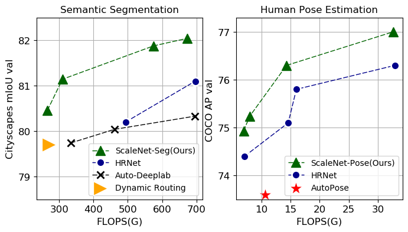

# ScaleNAS: One-Shot Learning of Scale-Aware Representations for Visual Recognition

## Introduction 
This is the official code of ScaleNAS: One-Shot Learning of Scale-Aware Representations for Visual Recognition.
Scale variance among different sizes of body parts and objects is a challenging problem for visual recognition
tasks. Existing works usually design a dedicated backbone or apply Neural architecture Search(NAS) for each task to
tackle this challenge. However, existing works impose significant limitations on the design or search space. To solve
these problems, we present ScaleNAS, a one-shot learning method for exploring scale-aware representations. Scale-
NAS solves multiple tasks at a time by searching multi-scale feature aggregation. ScaleNAS adopts a flexible search
space that allows an arbitrary number of blocks and crossscale feature fusions. To cope with the high search cost
incurred by the flexible space, ScaleNAS employs one-shot learning for multi-scale supernet driven by grouped sampling and evolutionary search. Without further retraining,
ScaleNet can be directly deployed for different visual recognition tasks with superior performance. We use Scale-
NAS to create high-resolution models for two different tasks, ScaleNet-P for human pose estimation and ScaleNet-S for
semantic segmentation. ScaleNet-P and ScaleNet-S outperform existing manually crafted and NAS-based methods in
both tasks. When applying ScaleNet-P to bottom-up human pose estimation, it surpasses the state-of-the-art HigherHRNet.
In particular, ScaleNet-P4 achieves 71.6% AP on COCO test-dev, achieving new state-of-the-art result.

## Search space design of ScaleNAS


## ScaleNAS consistently outperform hand-crafted and NAS-based methods on semantic segmentation and human pose estimation. 


## Quick start

### Installation

1. Install pytorch >= v1.1.0 following [official instruction](https://pytorch.org/).  
      ```
   # create a new environment 
   conda create -n scalenas python=3.6
   # install pytorch
   conda activate scalenas
   conda install pytorch==1.1.0 torchvision==0.3.0 cudatoolkit=9.0 -c pytorch
   ```
2. Clone this repo, and we'll call the directory that you cloned as ${ROOT}.

3. Install dependencies:
   ```
   pip install -r requirements.txt
   ```
   
4. Install [COCOAPI](https://github.com/cocodataset/cocoapi):
   ```
   # COCOAPI=/path/to/clone/cocoapi
   git clone https://github.com/cocodataset/cocoapi.git $COCOAPI
   cd $COCOAPI/PythonAPI
   # Install into global site-packages
   make install
   # Alternatively, if you do not have permissions or prefer
   # not to install the COCO API into global site-packages
   python3 setup.py install --user
   ```
   Note that instructions like # COCOAPI=/path/to/install/cocoapi indicate that you should pick a path where you'd like to have the software cloned and then set an environment variable (COCOAPI in this case) accordingly.
   
5. Init data, output(training model output directory) and log(tensorboard log directory) directory:

   ```
   mkdir output 
   mkdir log
   ```

   Your directory tree should look like this:

   ```
   ${ROOT}
   ├── data
   ├── experiments
   ├── figures
   ├── lib
   ├── log
   ├── models
   ├── output
   ├── tools 
   ├── README.md
   └── requirements.txt
   ```
   
6. Data Preparation

    **For COCO data**, please download from [COCO download](http://cocodataset.org/#download), 2017 Train/Val is needed for COCO keypoints training and validation. We also provide person detection result of COCO val2017 and test-dev2017 to reproduce our multi-person pose estimation results. Please download from [GoogleDrive](https://drive.google.com/drive/folders/1KWw8bUlj2WkPA9nEud7gS8zdxJRLRlmD?usp=sharing).
    Download and extract them under {ROOT}/data, and make them look like this:
    
    **For Cityscapes data**, you need to download the [Cityscapes](https://www.cityscapes-dataset.com/) datasets.
    
    Your directory tree should be look like this:
    ```
    ${ROOT}
    |-- data
    `-- |-- coco
        `-- |-- annotations
            |   |-- person_keypoints_train2017.json
            |   `-- person_keypoints_val2017.json
            |-- person_detection_results
            |   |-- COCO_val2017_detections_AP_H_56_person.json
            |   |-- COCO_test-dev2017_detections_AP_H_609_person.json
            `-- images
                |-- train2017
                `-- val2017
    `-- |-- cityscapes
        `-- |-- gtFine    
            |   |-- test           
            |   |-- train
            |   |-- val
        `-- |-- leftImg8bit    
            |   |-- test           
            |   |-- train
            |   |-- val        
    `-- |-- list
        `-- |-- cityscapes
            |   |-- test.lst
            |   |-- trainval.lst
            |   |-- val.lst
    ```

7. Download pretrained models from our model zoo([GoogleDrive](https://drive.google.com/drive/folders/1hfeBRWxnBO1HuVaAWhzm42AjjkroecEV?usp=sharing)) 
   ```
   ${ROOT}
    `-- models
        `-- pytorch
            |-- imagenet
            |   `-- superscalenet_imagenet_w32.pth
            |   `-- superscalenet_imagenet_w48.pth
            |-- pose_coco
            |   `-- superscalenet_pose_w32_256x192.pth
            |   `-- superscalenet_pose_w32_384x288.pth
            |   `-- superscalenet_pose_w48_384x288.pth
            |   `-- scalenet_P2_w32_256x192.pth
            |   `-- scalenet_P3_w32_384x288.pth
            |   `-- scalenet_P4_w48_384x288.pth
            |-- seg_seg_cityscapes
            |   `-- superscalenet_seg_w32.pth
            |   `-- superscalenet_seg_w48.pth
            |   `-- superscalenet_seg_w32_teacher.pth
            |   `-- superscalenet_seg_w48_teacher.pth
   ```
   

## Reproduce the final results

### Semantic Segmentation on Cityscapes

#### Results on Cityscapes val

|      Method     |      Backbone     | \#Params |  GFLOPs | mIoU |
|:---------------:|:-----------------:|:--------:|:-------:|:----:|
|    DeepLabv3    |    D-ResNet-101   |   58.0M  | 1778.73 | 78.5 |
|    DeepLabv3+   |   D-Xception-71   |   43.5M  | 1444.63 | 79.6 |
|      PSPNet     |    D-ResNet-101   |   65.9M  | 2017.63 | 79.7 |
|   Auto-DeepLab  | Searched-F20-ASPP |     -    |  333.3  | 79.7 |
| Dynamic Routing |    Layer33-PSP    |     -    |  270.0  | 79.7 |
|  ScaleNAS(Ours) |    ScaleNet-S1    |   25.3M  |  265.5  | 80.5 |
|  ScaleNAS(Ours) |    ScaleNet-S2    |   28.5M  |  309.5  | 81.1 |
|   Auto-DeepLab  | Searched-F48-ASPP |     -    |  695.0  | 80.3 |
|      HRNet      |     HRNet-W48     |   65.8M  |  696.2  | 81.1 |
|  ScaleNAS(Ours) |    ScaleNet-S4    |   67.5M  |  673.6  | 82.0 |

##### Note:
- Single scale and no flipping.
- The GFLOPs is calculated on the input size 1024× 2048.

#### Test use trained superscalenet_seg([GoogleDrive](https://drive.google.com/drive/folders/1hfeBRWxnBO1HuVaAWhzm42AjjkroecEV?usp=sharing)) 

ScaleNet-S1

````bash
python tools/scalenet_seg_test.py --cfg experiments/cityscapes/scalenet_seg_w32_test.yaml \
  --bn_calib --mask_path experiments/searched_masks/cityscapes/seg_w32_S1.npy \
  TEST.MODEL_FILE models/pytorch/seg_cityscapes/superscalenet_seg_w32.pth
````
after running this test, you should be able to see 
```
INFO: profile from scalenet_seg: Model superscalenet_seg: params 25.3 M, flops 265.5 G (with input size (1, 3, 1024, 2048))                                             
mean_IoU:  0.8059
...
```
ScaleNet-S4 (Require > 12GB memory)

````bash
python tools/scalenet_seg_test.py --cfg experiments/cityscapes/scalenet_seg_w48_test.yaml \
  --bn_calib --mask_path experiments/searched_masks/cityscapes/seg_w48_S4.npy \
  TEST.MODEL_FILE models/pytorch/seg_cityscapes/superscalenet_seg_w48.pth
````

#### Train superscalenet_seg

First, you should download the teacher model in [GoogleDrive](https://drive.google.com/drive/folders/1hfeBRWxnBO1HuVaAWhzm42AjjkroecEV?usp=sharing)


SuperScaleNet_Seg_W32

````bash
python -m torch.distributed.launch --nproc_per_node=8  tools/train_superscalenet_seg.py \
  --cfg experiments/cityscapes/superscalenet_seg_w32_oneshot_train_ohem_512x1024_sgd_lr1e-3_wd5e-4_bs_24_epoch484_group_sampling.yaml \
  --oneshot_train --use_kd
````

SuperScaleNet_Seg_W48

````bash
python -m torch.distributed.launch --nproc_per_node=8  tools/train_superscalenet_seg.py \
  --cfg experiments/cityscapes/superscalenet_seg_w48_oneshot_train_ohem_512x1024_sgd_lr1e-3_wd5e-4_bs_24_epoch484_group_sampling.yaml \
  --oneshot_train --use_kd
````

### Pose Estimation on COCO

#### Results on COCO val

|     Method     |   Backbone  | Input size | #Params | GFLOPs |  AP  | AP50 | AP75 |  APM |  APL |  AR  |
|:--------------:|:-----------:|:----------:|:-------:|:------:|:----:|:----:|:----:|:----:|:----:|:----:|
| SimpleBaseline |  ResNet-152 |   256x192  |  68.6M  |  15.7  | 72.0 | 89.3 | 79.8 | 68.7 | 78.9 | 77.8 |
|    AutoPose    |  AutoPose*  |   256x192  |    -    |  10.65 | 73.6 | 90.6 | 80.1 | 69.8 | 79.7 | 78.1 |
|      HRNet     |  HRNet-W48  |   256x192  |  63.6M  |  14.6  | 75.1 | 90.6 | 82.2 | 71.5 | 81.8 | 80.4 |
| ScaleNAS(Ours) | ScaleNet-P2 |   256x192  |  35.6M  |   8.0  | 75.2 | 90.4 | 82.4 | 71.6 | 81.9 | 80.4 |
|      PNFS      |  PoseNFS-3  |   384x288  |    -    |  14.8  | 73.0 |   -  |   -  |   -  |   -  |      |
| SimpleBaseline |  ResNet-152 |   384x288  |  68.6M  |  35.6  | 74.3 | 89.6 | 81.1 | 70.5 | 79.7 | 79.7 |
|      HRNet     |  HRNet-W48  |   384x288  |  63.6M  |  32.9  | 76.3 | 90.8 | 82.9 | 72.3 | 83.4 | 81.2 |
| ScaleNAS(Ours) | ScaleNet-P3 |   384x288  |  26.2M  |  14.3  | 76.3 | 90.7 | 82.9 | 72.5 | 83.3 | 81.3 |
| ScaleNAS(Ours) | ScaleNet-P4 |   384x288  |  64.3M  |  32.6  | 77.0 | 90.9 | 83.6 | 73.0 | 84.2 | 81.8 |

##### Note:
- ScaleNet-P models are further fine tuned 20 epochs from SuperScaleNet_Pose

#### Test use finetuned scalenet_P([GoogleDrive](https://drive.google.com/drive/folders/1hfeBRWxnBO1HuVaAWhzm42AjjkroecEV?usp=sharing)) 

ScaleNet-P2
````bash
python tools/scalenet_pose_test.py --cfg experiments/coco/scalenet/scalenet_P2_w32_256x192_test.yaml \
  TEST.MODEL_FILE models/pytorch/pose_coco/scalenet_P2_w32_256x192.pth \
  TEST.USE_GT_BBOX False
````

ScaleNet-P3
````bash
python tools/scalenet_pose_test.py --cfg experiments/coco/scalenet/scalenet_P3_w32_384x288_test.yaml \
  TEST.MODEL_FILE models/pytorch/pose_coco/scalenet_P3_w32_384x288.pth \
  TEST.USE_GT_BBOX False
````

ScaleNet-P4
````bash
python tools/scalenet_pose_test.py --cfg experiments/coco/scalenet/scalenet_P4_w48_384x288_test.yaml \
  TEST.MODEL_FILE models/pytorch/pose_coco/scalenet_P4_w48_384x288.pth \
  TEST.USE_GT_BBOX False
````

### Evolutionary Search for Semantic Segmentation

1. Initialization. We uniformly sample 1000 sub-networks and record their architectures, accuracies,and FLOPs as a set D.

````bash
for f in 0.2 0.35 0.5 0.65 0.8
do
  for d in [2,3] [3,4] [4,5]
  do
    python -u tools/random_seg_test.py \
     --cfg experiments/cityscapes/scalenet_seg_w32_test.yaml \
     --save_name superscalenet_seg_w32 \
     --sample_num 67 \
     --bn_calib \
     --fusion_percentage $f \
     --depth_list $d  \
     TEST.MODEL_FILE models/pytorch/seg_cityscapes/superscalenet_seg_w32.pth &
  done
done
````

2. Generate offsprings. We select top-100 models on the Pareto front of cost/accuracy trade-off curve in D as candidate group C. Use [evo_server](tools/evo_server.py) to generate next generation.

3. Record offsprings' architectures, accuracies,and FLOPs using [evo_seg_test](tools/evo_seg_test.py)
